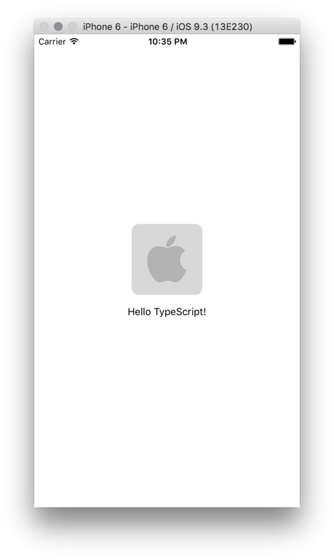
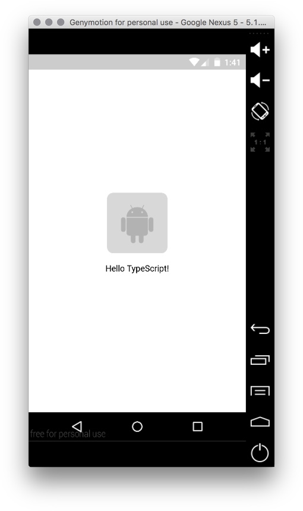

# ReactNative TypeScript Starter Project

Clone the project and install dependencies:

```sh
git clone https://github.com/hayeah/rnplay-typescript-starter.git MyApp
cd MyApp
npm install
```

We'll use [rnplay](https://github.com/hayeah/rnplay) to run this project:

```sh
npm install -g rnplay
```

# Building The Project

Build the project once:

```sh
make build
```

Rebuild the project automaically when files change:

```sh
make watch
```

# Running The Project

Start the ReactNative packager:

```sh
rnplay packager
```

Build & deploy the iOS app:

```sh
rnplay ios
```



Build & deploy the Android app:

```sh
rnplay android
```



# The Project Organization

The ReactNative packager doesn't support TypeScript. Our strategy is to put
TypeScript files in the `src` directory, and compile ES6 output to the `lib` library. The ReactNative packager will then bundle everything in `lib` as usual.

The TypeScript entry file is `src/App.tsx`, which will compile to `lib/App.js`. All that `index.ios.js` and `index.android.js` is doing is to register the component exported by `lib/App.js`.

```js
import { App } from "./lib/App";
AppRegistry.registerComponent('SampleApp', () => App);
```

## Platform Specific Code

The TypeScript compiler doesn't support ReactNative's special extensions for platform specific source files (i.e. `.ios.js` and `.android.js`)

Instead we'll import platform booleans from the `constants.ts` module:

```js
import {
  isAndroid,
  isIOS,
} from "./constants";

if (isAndroid) {
  ...
}

if (isIOS) {
  ...
}
```

## Assets

Put static assets like images and videos in the assets directory. These files will be bundled with the app for release.

## Theme

To keep things tidy, I like to put shared style values in the `theme.ts` module. For example, we can export common colors and icons like this:

```js
import { isIOS } from "./constants";

export const icons = {
  badge: isIOS ? require("../assets/ios-badge.png") : require("../assets/android-badge.png")
};

export const colors = {
  bg: "#fff",
  text: "#000",
}
```

